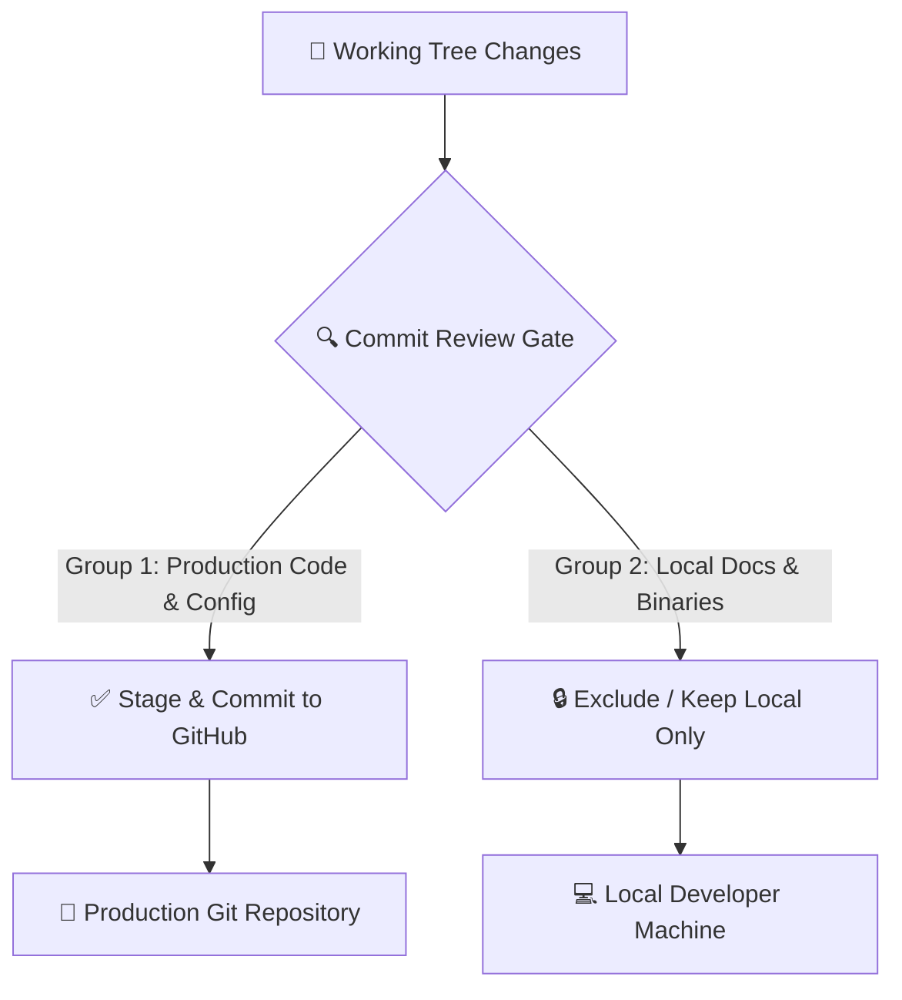

# KnowledgePaat: Final Git Commit Review Report

> [!NOTE]
> **Audit Status**: 🟢 **READY FOR FINAL COMMIT**  
> **Security Audit Check**: 🟢 **PASSED** (0 hardcoded API keys, 0 Supabase service role keys, 0 passwords, and 0 personal credentials found in any source files).  
> **Git Action Policy**: Analysis only. Zero repository modifications have been made.

---

## 1. Executive Summary

This document provides the final, evidence-based **Git Commit Review** for KnowledgePaat (`CareerLaunch2`). Every modified file and untracked artifact has been audited against security guidelines, repository hygiene rules, and production deployment requirements.



---

## 2. Comprehensive File Classification Table

| File Path | Category | Reason & Description | Safe to Commit? |
| :--- | :---: | :--- | :---: |
| `.gitignore` | **A. COMMIT TO GITHUB** | Root repository exclusion rules (protects local binaries/secrets) | **YES** |
| `supabase_performance_indexes.sql` | **A. COMMIT TO GITHUB** | Phase 5 Performance Migration (18 composite B-tree & GIN indexes) | **YES** |
| `frontend/app/error.tsx` | **A. COMMIT TO GITHUB** | Phase 8 Root route error boundary component with retry UI | **YES** |
| `frontend/app/global-error.tsx` | **A. COMMIT TO GITHUB** | Phase 8 Global layout error boundary component | **YES** |
| `frontend/lib/clientQueryCache.ts` | **A. COMMIT TO GITHUB** | Phase 6 Zero-dependency SWR client query cache engine | **YES** |
| `frontend/hooks/useClientQuery.ts` | **A. COMMIT TO GITHUB** | Phase 6 React SWR query cache hook | **YES** |
| `frontend/lib/logger.ts` | **A. COMMIT TO GITHUB** | Phase 8 Structured JSON logger with automatic PII scrubbing | **YES** |
| `frontend/lib/rateLimit.ts` | **A. COMMIT TO GITHUB** | Phase 3 Sliding-window token bucket API rate limiter | **YES** |
| `load-tests/config/environment.js` | **A. COMMIT TO GITHUB** | Phase 9 k6 load testing environment configuration | **YES** |
| `load-tests/scenarios/smoke.js` | **A. COMMIT TO GITHUB** | Phase 9 k6 smoke test scenario script | **YES** |
| `load-tests/scenarios/public-browsing.js` | **A. COMMIT TO GITHUB** | Phase 9 k6 multi-stage 500 VU browsing scenario | **YES** |
| `load-tests/scenarios/rate-limiting.js` | **A. COMMIT TO GITHUB** | Phase 9 k6 burst rate limiting test scenario | **YES** |
| `load-tests/scenarios/infrastructure-benchmark.js` | **A. COMMIT TO GITHUB** | Phase 10 k6 live cloud benchmark scenario | **YES** |
| `frontend/app/admin/dashboard/page.tsx` | **A. COMMIT TO GITHUB** | Optimized admin dashboard with Promise.all parallel queries | **YES** |
| `frontend/app/admin/interview-questions/page.tsx` | **A. COMMIT TO GITHUB** | Paginated interview question management | **YES** |
| `frontend/app/admin/jobs/page.tsx` | **A. COMMIT TO GITHUB** | Paginated job management with server count | **YES** |
| `frontend/app/admin/students/page.tsx` | **A. COMMIT TO GITHUB** | Server-side paginated student directory | **YES** |
| `frontend/app/api/admin/interview-questions/bulk-import/route.ts` | **A. COMMIT TO GITHUB** | Protected rate-limited bulk importer route | **YES** |
| `frontend/app/api/admin/jobs/bulk-import/route.ts` | **A. COMMIT TO GITHUB** | Protected rate-limited job importer route | **YES** |
| `frontend/app/api/career-intelligence/generate-plan/route.ts` | **A. COMMIT TO GITHUB** | Rate-limited AI career plan generation endpoint | **YES** |
| `frontend/app/api/career-intelligence/update-task/route.ts` | **A. COMMIT TO GITHUB** | Secure milestone progress update endpoint | **YES** |
| `frontend/app/api/career-progress/route.ts` | **A. COMMIT TO GITHUB** | Consolidated career readiness calculation endpoint | **YES** |
| `frontend/app/api/feature-flags/route.ts` | **A. COMMIT TO GITHUB** | Dynamic portal feature flag provider | **YES** |
| `frontend/app/api/mock-interview/complete-interview/route.ts` | **A. COMMIT TO GITHUB** | Mock interview completion and scorecard handler | **YES** |
| `frontend/app/api/mock-interview/evaluate-answer/route.ts` | **A. COMMIT TO GITHUB** | AI answer evaluation with duration logging | **YES** |
| `frontend/app/api/mock-interview/start-ai-interview/route.ts` | **A. COMMIT TO GITHUB** | Gated adaptive interview starter | **YES** |
| `frontend/app/api/mock-interview/submit-answer/route.ts` | **A. COMMIT TO GITHUB** | Rate-limited interview answer submission | **YES** |
| `frontend/app/api/social-links/route.ts` | **A. COMMIT TO GITHUB** | Rate-limited public settings handler | **YES** |
| `frontend/app/api/speech-to-text/route.ts` | **A. COMMIT TO GITHUB** | Protected audio speech-to-text endpoint | **YES** |
| `frontend/app/api/student/interview-prep/submit-test/route.ts` | **A. COMMIT TO GITHUB** | Timed test auto-scoring and submission route | **YES** |
| `frontend/app/student/career-progress/page.tsx` | **A. COMMIT TO GITHUB** | Student career progress dashboard with SWR cache | **YES** |
| `frontend/app/student/dashboard/page.tsx` | **A. COMMIT TO GITHUB** | Student dashboard with parallel data fetching | **YES** |
| `frontend/app/student/interview-preparation/page.tsx` | **A. COMMIT TO GITHUB** | Interview prep directory with client SWR caching | **YES** |
| `frontend/app/student/jobs/page.tsx` | **A. COMMIT TO GITHUB** | Jobs listing with server pagination & SWR cache | **YES** |
| `frontend/app/student/mock-interview/page.tsx` | **A. COMMIT TO GITHUB** | AI mock interview session launcher | **YES** |
| `frontend/app/student/notes/page.tsx` | **A. COMMIT TO GITHUB** | Study notes catalog with SWR caching | **YES** |
| `frontend/data/feature_flags.json` | **A. COMMIT TO GITHUB** | Dynamic feature flags configuration | **YES** |
| `frontend/lib/careerProgress.ts` | **A. COMMIT TO GITHUB** | Parallelized career progress calculator | **YES** |
| `KnowledgePaat_Final_Implementation_...docx` | **B. KEEP LOCAL ONLY** | Formatted Word review document (binary document) | **NO (Local Only)** |
| `KnowledgePaat_Final_Implementation_...pdf` | **B. KEEP LOCAL ONLY** | Formatted PDF review document (binary document) | **NO (Local Only)** |
| `KnowledgePaat_Safe_Project_File_...docx` | **B. KEEP LOCAL ONLY** | Formatted Word cleanup audit document | **NO (Local Only)** |
| `KnowledgePaat_Safe_Project_File_...pdf` | **B. KEEP LOCAL ONLY** | Formatted PDF cleanup audit document | **NO (Local Only)** |
| `KNOWLEDGEPAAT_ARCHITECTURE_REVIEW_REPORT.docx` | **B. KEEP LOCAL ONLY** | Local Word architecture report | **NO (Local Only)** |
| `KNOWLEDGEPAAT_CAPACITY_AND_PERFORMANCE_REPORT.docx`| **B. KEEP LOCAL ONLY** | Local Word performance report | **NO (Local Only)** |
| `scripts/generate_final_audit_documents.py` | **B. KEEP LOCAL ONLY** | Local python document generation script | **NO (Local Only)** |
| `scripts/generate_cleanup_audit_doc.py` | **B. KEEP LOCAL ONLY** | Local python cleanup doc generator | **NO (Local Only)** |
| `scripts/test_doc_env.py` | **B. KEEP LOCAL ONLY** | Local python environment testing utility | **NO (Local Only)** |
| `load-tests/bin/k6.exe` (66.4 MB) | **C. SHOULD BE IGNORED** | Windows executable binary (Ignored by `.gitignore`) | **NO (Ignored)** |
| `backend/venv/` | **D. MANUAL REVIEW** | Legacy Python virtual environment (Tracked in history) | **NO (Do not add)** |

---

## 3. Exact Git Command Groups

### GROUP 1: Files Recommended to Add and Commit
> [!TIP]
> Run these commands to stage and commit all verified production features, performance optimizations, and load testing scripts:

```bash
git add .gitignore
git add supabase_performance_indexes.sql
git add frontend/app/error.tsx
git add frontend/app/global-error.tsx
git add frontend/lib/clientQueryCache.ts
git add frontend/hooks/useClientQuery.ts
git add frontend/lib/logger.ts
git add frontend/lib/rateLimit.ts
git add frontend/lib/careerProgress.ts
git add frontend/data/feature_flags.json
git add frontend/app/admin/
git add frontend/app/student/
git add frontend/app/api/
git add load-tests/config/
git add load-tests/scenarios/

git commit -m "feat(core): performance optimizations, rate limiting, SWR query cache, error boundaries, and k6 load test suite"
```

---

### GROUP 2: Files That Must NOT Be Added
> [!IMPORTANT]
> These files must remain local or excluded from Git tracking:

```
# Do NOT stage these files:
- KnowledgePaat_Final_Implementation_Architecture_Security_Performance_Analysis.docx
- KnowledgePaat_Final_Implementation_Architecture_Security_Performance_Analysis.pdf
- KnowledgePaat_Safe_Project_File_Cleanup_Audit.docx
- KnowledgePaat_Safe_Project_File_Cleanup_Audit.pdf
- KNOWLEDGEPAAT_ARCHITECTURE_REVIEW_REPORT.docx
- KNOWLEDGEPAAT_CAPACITY_AND_PERFORMANCE_REPORT.docx
- scripts/
- load-tests/bin/
- frontend/.env
```
